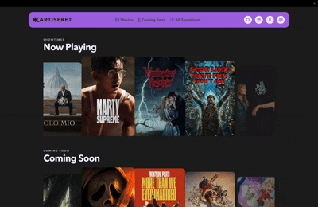

<p align="center">
  
</p>

<h1 align="center">Kartiseret</h1>

<p align="center">
  One place to see what's playing, what's coming next, and where to catch it across Israeli cinemas.
</p>

<p align="center">
  
  
  
  
  
  
</p>

> Most cinema sites answer one theater at a time.
> Kartiseret is built around a different question: what is playing, where can I watch it, and what should I open first?

<p align="center">
  <a href="https://www.seret.site/">Take me there →</a>
</p>

<p align="center">
  
</p>

## Overview

Kartiseret is a movie discovery and showtimes platform built to make cinema browsing feel unified instead of fragmented. On the product side, it powers a motion-heavy React + TypeScript single-page app for browsing now-playing films, coming-soon releases, city and theater options, trailers, ratings, and user preferences. On the data side, it relies on a Python scraping and enrichment pipeline that collects listings from cinema websites, cleans inconsistent titles and metadata, enriches records with TMDb and other external sources, and writes the results into Supabase.

The goal is simple: reduce the friction between "I want to watch a movie tonight" and "here are the real options."

> Note
> This checkout currently contains the Python backend, automation, and project metadata. The frontend architecture described below reflects the current Kartiseret app, but its source is not present in this workspace.

## Why This Exists

Going to the movies should not require opening six tabs, guessing which listings are stale, and manually comparing showtimes city by city.

Kartiseret exists to make that flow calmer and more useful:

- aggregate listings across multiple cinema chains and cinematheques
- show now-playing and coming-soon movies in one coherent browsing experience
- make city and theater selection feel visual instead of tedious
- surface trailers, ratings, and metadata without burying showtimes
- keep the data pipeline transparent and maintainable

## Highlights

- Custom React + TypeScript frontend focused on now-playing and coming-soon discovery.
- Animated homepage scrollers with a custom detail mode instead of a third-party carousel.
- Client-side search across both current and upcoming movies, with title and year-aware ranking.
- MapLibre-based city and theater picker with search, geolocation, focus controls, and theater marker popups.
- Supabase Auth-powered user menu with saved preferences for location, rating sources, and site accent color.
- Guest-friendly local caching for location and theme color.
- Selenium scrapers for major Israeli cinema chains plus several cinematheques.
- Multi-stage backend dataflow for cleaning, TMDb matching, metadata enrichment, deduplication, and preview-table generation.
- Failure artifacts that capture screenshots, text traces, and CSV snapshots of scraped rows.
- Daily cleanup automation for expired showtimes and old soon entries.

## Platform Snapshot

Kartiseret currently spans two connected layers:

1. A browser app that reads directly from Supabase using only a publishable key.
2. A Python pipeline that scrapes source sites, enriches records, and maintains the tables the frontend depends on.

### Frontend Experience

- Built as a client-side React 19.2.0 + TypeScript 5.9.3 SPA with Vite 7.3.1.
- Uses custom `window.history` routing instead of React Router.
- Uses React state/hooks plus a few singleton stores instead of Redux, Zustand, React Query, or SWR.
- Styles are global CSS-driven, accent-color-driven, and motion-heavy rather than Tailwind-based.
- Code-splits secondary screens with `React.lazy` and `Suspense`.
- Reads movie data directly from Supabase in the browser rather than through a separate API layer.
- Loads data in stages for perceived speed: now-playing preview, coming-soon preview, then full datasets and showtimes.
- Supports homepage, `/movies`, `/soons`, `/showtimes`, and `/user` routes.
- Treats `/showtimes` as a placeholder route right now rather than a finished page.
- Gates `/user` behind authentication and keeps the auth UI inside the user menu rather than on a dedicated auth page.

### Frontend UX Details

- Homepage leads with animated "Now Playing" and "Coming Soon" scrollers.
- Search is client-side only and returns up to 10 ranked results across both catalogs.
- Opening a movie transitions from card to detail mode with a ghost-poster handoff animation.
- Detail mode supports keyboard arrows, swipe gestures, wheel-based horizontal navigation, Escape to close, and adjacent poster previews.
- Now-playing detail view emphasizes showtimes by day and theater.
- Coming-soon detail view emphasizes release date and trailer presentation.
- Ratings can surface from IMDb, Rotten Tomatoes, Letterboxd, and TMDb when IDs and scores are available.
- The city picker uses MapLibre GL with the CARTO Dark Matter style and supports nearest-city geolocation.

<details>
<summary><strong>Current canonical locations used by the frontend</strong></summary>

Ashdod, Ashkelon, Ayalon, Beer Sheva, Carmiel, Chadera, Even Yehuda, Givataim, Glilot, Haifa, Herziliya, Jerusalem, Kfar Saba, Kiryat Bialik, Kiryat Ono, Modiin, Nahariya, Netanya, Omer, Petach Tikvah, Raanana, Ramat Hasharon, Rehovot, Rishon Letzion, Tel Aviv, Zichron Yaakov.

</details>

### Backend Pipeline

- Written in Python and currently pinned only through `requirements.txt`, with GitHub Actions using Python `3.14.2`.
- Uses Selenium + Chrome for source scraping.
- Uploads data into Supabase using the service-role key.
- Uses TMDb for movie matching and core metadata enrichment.
- Enriches now-playing movies further with IMDb, Rotten Tomatoes, and Letterboxd data when available.
- Retries individual scraper/dataflow jobs up to three times before marking the run as failed.
- Stores run logs, timing metadata, and failure artifacts under `backend/utils/log/logger_artifacts/`.

### Source Coverage In This Repo

- Now playing scrapers: `Lev Cinema`, `Rav Hen`, `MovieLand`, `Hot Cinema`, `Yes Planet`, `Cinema City`
- Coming-soon scrapers: `Lev Cinema`, `Yes Planet`, `Cinema City`, `Hot Cinema`, `MovieLand`
- Cinematheque coverage: `Jaffa Cinema`, `Sam Spiegel Cinema`, `Holon Cinematheque`, `Herziliya Cinematheque`, `Haifa Cinematheque`, `Jerusalem Cinematheque`, `Tel Aviv Cinematheque`

### Backend Flow

The default run plan is:

1. Scrape `allSoons`
2. Scrape `allShowtimes`
3. Run coming-soon dataflows
4. Run now-playing dataflows

Within that plan, the backend currently does the following:

1. Scrapes raw source rows into Supabase tables like `allShowtimes` and `allSoons`.
2. Normalizes titles, removes obviously bad rows, and performs source-specific cleanup.
3. Matches films against TMDb, moves accepted rows into final tables, and marks processed source rows as added.
4. Enriches final movie records with posters, backdrops, trailers, genres, ratings, and popularity metadata.
5. Deduplicates final showtimes, movies, and soon entries using table-specific preference rules.
6. Builds preview tables so the frontend can render small "fast first paint" scrollers before the full catalog finishes loading.

## Supabase Shape

<details>
<summary><strong>Current table snapshot</strong></summary>

**Backend raw ingest**

- `allShowtimes`
- `allSoons`

**Final / enriched tables**

- `finalShowtimes`
- `finalMovies`
- `finalSoons`
- `theaters`
- `userPreferences`

**Helper / ops tables**

- `tableFixes`
- `tableSkips`
- `utilRunLogs`
- `utilAvgTime`

This repo includes generic Supabase table utilities in `backend/utils/supabase/supabase_tables.py`.

</details>

## Run Locally

### Backend In This Repo

Requirements:

- Python 3.14 or newer
- Google Chrome installed locally
- A Supabase project and service-role key
- A TMDb API key

Environment variables:

- `SUPABASE_URL`
- `SUPABASE_SERVICE_ROLE_KEY`
- `TMDB_API_KEY`
- `RUNNER_MACHINE` optional, but useful for local timing stats

Setup and run:

```bash
python -m venv .venv
. .venv/bin/activate
python -m pip install --upgrade pip
pip install -r requirements.txt

export PYTHONPATH="$PWD"
export SUPABASE_URL="https://your-project.supabase.co"
export SUPABASE_SERVICE_ROLE_KEY="your-service-role-key"
export TMDB_API_KEY="your-tmdb-api-key"
export RUNNER_MACHINE="local"

python -m backend.config.runner
```

Local runs open an interactive Rich terminal menu so you can choose a full run or a narrower subset of scrapers/dataflows. In GitHub Actions and weekly shell runs, the default plan runs headlessly.

Cleanup expired data:

```bash
. .venv/bin/activate
export PYTHONPATH="$PWD"
python backend/utils/supabase/clear_old_entries.py
```

### Frontend Runtime Notes

The current frontend app expects:

- `SUPABASE_URL` or `VITE_SUPABASE_URL`
- `SUPABASE_PUBLISHABLE_KEY` or `VITE_SUPABASE_PUBLISHABLE_KEY`

The browser app intentionally uses only the publishable key and never a service-role key.

## Automation

- `.github/workflows/run_main.yml` runs the main backend pipeline manually in GitHub Actions and uploads run artifacts.
- `.github/workflows/daily_sweep.yml` clears old showtimes and soon entries on a daily schedule.
- `backend/config/cron/run_weekly.sh` is a local weekly shell runner that syncs the repo, runs the full job, commits artifacts/logs, and pushes them back to `main`.
- `backend/config/cron/run_daily.sh` is a local daily shell runner that performs the same default headless run, writes separate daily logs, and pushes artifacts/logs back to `main`.
- `backend/config/cron/run_realtime_watcher.sh` runs a local realtime listener for `finalMovies` and `finalSoons`.
  - watcher-triggered update runs use `solo_update` mode (`SOLO_UPDATE_ONLY=true`) and process only rows where `solo_update = true`, then reset `solo_update` back to `false` on processed rows.
  - watcher-triggered runs write `utilRunLogs.run_from` as `np_solo_update` (for `finalMovies`) or `cs_solo_update` (for `finalSoons`).
  - regular daily/weekly/manual runs are unchanged and still process full tables.

## Project Tour

<details>
<summary><strong>Structure</strong></summary>

```text
.
├── .github/workflows/   GitHub Actions for main runs, cleanup, and license maintenance
├── backend/
│   ├── config/          Runner entrypoints, registries, and cron helpers
│   ├── scraping/        Selenium scrapers for chains, coming-soon pages, and cinematheques
│   ├── dataflow/        Cleaning, TMDb matching, enrichment, dedupe, and preview generation
│   └── utils/           Console UI, logging artifacts, and Supabase helpers
├── docs/images/         README assets
├── LICENSE.md
├── README.md
└── requirements.txt
```

</details>

### Key Files

- `backend/config/registry.py` defines the scraper registries and the staged dataflow registries.
- `backend/config/runner.py` is the main entry point for local, weekly, and GitHub Actions runs.
- `backend/config/runners.py` orchestrates parallel scraper execution, sequential dataflows, retries, and runtime reporting.
- `backend/scraping/BaseCinema.py` defines the base Selenium scraping contract used across all cinema sources.
- `backend/dataflow/nowplayings/NowPlayingsTmdb.py` handles now-playing grouping, TMDb matching, and movement into final showtime/movie tables.
- `backend/dataflow/nowplayings/NowPlayingsUpdate.py` performs richer metadata enrichment for now-playing movies.
- `backend/dataflow/comingsoons/ComingSoonsTmdb.py` matches and enriches coming-soon titles before final dedupe.
- `backend/utils/log/artifact_logging.py` writes screenshots and text diagnostics whenever a run fails.
- `backend/utils/supabase/clear_old_entries.py` removes expired showtimes and stale soon entries from Supabase.

## Current Limitations

- This workspace does not currently include the React frontend source, only the backend pipeline and repo automation.
- The frontend is tightly coupled to its Supabase table names and column assumptions.
- No automated tests are configured in this repo right now.
- Scrapers depend on third-party cinema DOMs, so upstream site changes can break individual sources without warning.

## Assets For This README

Place your PNGs here:

| Asset | Path | Used for |
| --- | --- | --- |
| Logo | `docs/images/logo.png` | Centered logo at the top of the README |
| Demo GIF | `docs/images/ks1.gif` | Centered hero media rendered at `500px` width |

## Notes For Contributors

- Keep the Supabase contract in mind whenever backend tables or frontend assumptions change.
- If you touch TMDb matching, dedupe rules, or title normalization, verify both now-playing and coming-soon flows.
- Use run artifacts when debugging scraper failures; the screenshot + text + CSV bundle is part of the intended workflow.
- Treat source-site changes as expected maintenance, not exceptional events.
- If the frontend lives in a separate workspace, UI changes should still be checked for keyboard navigation, motion fallbacks, mobile layout, and auth/preference behavior.

## License

This project is available under the [MIT License](LICENSE.md).
